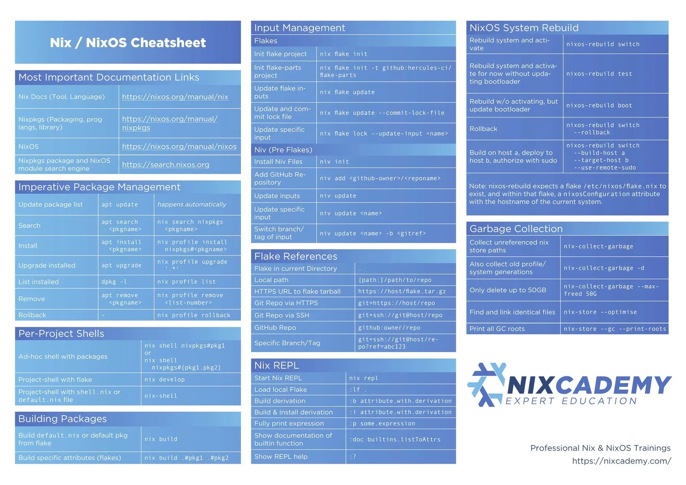

## Nix cheatsheet

## Nix Flakes

[Read detail here](./docs/NIX_FLAKE.md)

[Introduction to Flakes | NixOS & Flakes Book](https://nixos-and-flakes.thiscute.world/nixos-with-flakes/introduction-to-flakes)

[flake.nix Configuration Explained | NixOS & Flakes Book](https://nixos-and-flakes.thiscute.world/nixos-with-flakes/nixos-flake-configuration-explained)

### Dev environment with flakes

[Development Environments on NixOS | NixOS & Flakes Book](https://nixos-and-flakes.thiscute.world/development/intro)

[Easy development environments with Nix and Nix flakes!](https://dev.to/arnu515/easy-development-environments-with-nix-and-nix-flakes-21mb)

## References

- [Nix language](https://nix.dev/tutorials/nix-language)
- [Nix Flakes Book (ryan4yin)](https://nixos-and-flakes.thiscute.world/) — Best beginner-friendly guide
- [nix.dev](https://nix.dev/) — Official Nix documentation
- [NixOS/nixpkgs](https://github.com/NixOS/nixpkgs) — Package repository
- [nix-community/nix-direnv](https://github.com/nix-community/nix-direnv) — Fast direnv integration
- [cachix/git-hooks.nix](https://github.com/cachix/git-hooks.nix) — Pre-commit hooks as Nix flake
- [numtide/treefmt-nix](https://github.com/numtide/treefmt-nix) — Unified formatting
- [hercules-ci/flake-parts](https://github.com/hercules-ci/flake-parts) — Composable flake modules
- [Platonic-Systems/process-compose-flake](https://github.com/Platonic-Systems/process-compose-flake) — Service orchestration
- [juspay/services-flake](https://github.com/juspay/services-flake) — Pre-built service definitions
- [devenv.sh](https://devenv.sh/) — Higher-level dev environments on Nix
- [Determinate Systems Nix Installer](https://github.com/DeterminateSystems/nix-installer) — Recommended installer
